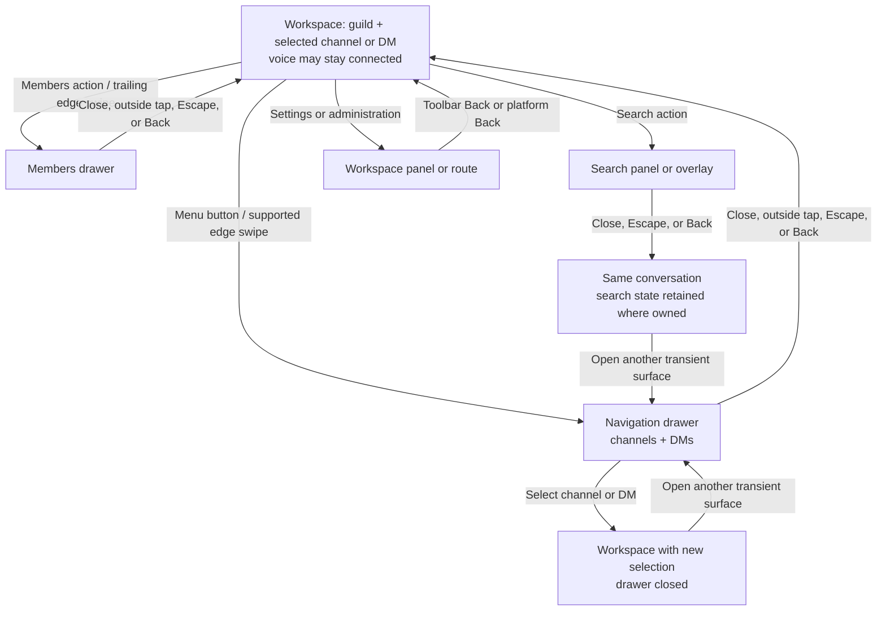

# Mobile navigation and Back contract (#292)

This contract describes transient navigation around the selected workspace context. A channel/DM selection and the active voice connection are independent: closing a drawer or changing the visible conversation must not disconnect voice.

## Flow-state diagram

On Web, opening a drawer/search/admin overlay adds one history entry. Browser Back closes the current overlay; Forward restores it. Selecting a channel clears transient drawer history. On Flutter, system Back closes the top workspace drawer first, then closes workspace search, and only then reaches the enclosing route. Escape follows the same overlay-first rule. Dialogs keep their separate cancel-first contract in [`UIUX_2026_DIALOG_CONTRACT.md`](UIUX_2026_DIALOG_CONTRACT.md).

## Interaction contract and evidence

| Action | Expected result | Automated evidence | Remaining acceptance |
| --- | --- | --- | --- |
| Open navigation, members or search | Exactly one transient surface is active; underlying guild/channel/DM and active voice state remain mounted. | Web fixture exercises navigation/search/admin history; Flutter widget test opens both drawers while connected to voice. | Full authenticated-app and physical-device checks are in #303. |
| Close drawer | Close button, outside tap, Escape or Back dismisses the overlay. Focus returns to the prior focus target; no hidden drawer control remains in the active focus scope. | Web tests cover close button, backdrop, Escape, browser Back/Forward, focus containment and restoration. Flutter tests cover close controls and now assert focus restoration after `handlePopRoute()`. | VoiceOver/TalkBack review remains in #301. |
| Select channel or DM | Drawer closes after selection. Selected context updates; a live voice connection remains connected. | Web browser-history fixture and Flutter iOS/Android widget flow assert channel selection and retained connected voice state. | Physical LiveKit call acceptance remains in #303. |
| Identify the selected channel or DM | The persistent conversation header names the selected channel or other DM participant after navigation. | Production Web lifecycle now checks the channel and DM headings on desktop/mobile and captures the empty-DM header in a disposable full-stack run. | Physical browser/device acceptance remains in #303. |
| Return from search/settings/admin | One Back closes the top transient panel before leaving the workspace. Search results/query stay with their owning DM where covered. | Web Back/Forward fixture covers search/admin overlays; #294 production DM coverage retains query/results per conversation and restores the original result context. Flutter `PopScope` covers drawers/search; profile has an explicit Back toolbar check. | Authenticated direct links/refresh and native route-stack behavior still need device review in #303. |
| Use platform gestures | Android system Back closes workspace overlays. iOS/Android edge swipes open or close the workspace drawers. iOS interactive route Back is a distinct OS gesture. | Flutter widget test runs the system-pop and drawer-swipe cases with iOS and Android target platforms; Web emulation is not treated as native gesture evidence. | Physical Android Back and iOS route gesture with active LiveKit call remain `NOT_RUN` in #303. |

## Current automated coverage

- Web: `clients/web/tests/responsive_shell/responsive_shell.browser.spec.ts` covers reload, Back/Forward across navigation/search/admin, channel selection, active-voice presentation, Escape, focus trapping and restoration. Its fixture uses the production drawer-history helper. The separate `focus_fixture.html` mounts the production focus manager.
- Flutter: `clients/flutter/test/workspace_screen_test.dart`, `mobile edge swipes open and close both workspace panels`, runs under iOS and Android target-platform overrides. It opens the navigation drawer while a text composer owns focus and voice remains connected, verifies Escape and a platform pop close the drawer and return focus without changing voice, then covers drawer swipes, channel selection and the members drawer.
- These widget/browser checks establish deterministic client behavior only. They do not claim physical iOS edge-back, Android OS integration, screen-reader acceptance, or a real LiveKit call on a device.
