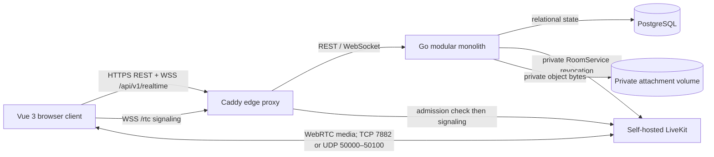

# Архитектура и границы доверия

## Статус

Это companion к [SPEC.md](SPEC.md). Он фиксирует фактическую архитектуру текущего исходного кода и не подтверждает незапущенные POC или capacity claims.

## Контур компонентов

Go owns authentication, authorization, channels, conversations, messages, attachments, logical voice leases and credential issuance. LiveKit transports media only; no RTP, RTCP or media payload crosses the Go API. Caddy terminates public HTTPS and forwards `/rtc` only after private API admission. PostgreSQL, attachment storage, LiveKit management HTTP and `/metrics` stay off the public edge.

## Compose deployment model

| Component | Responsibility | Exposure / persistence |
| --- | --- | --- |
| `proxy` | HTTPS termination, headers, REST/web routing, `/rtc` admission forwarding | Edge ports 80/443; Caddy data/config volumes |
| `web` | Built Vue SPA | Private network only |
| `api` | Go HTTP/WebSocket/API and private LiveKit worker | Private network only; attachment volume |
| `migrate` | Versioned schema migration before API startup | One-shot, private network only |
| `postgres` | Relational state | Private network; `postgres-data` persistent volume |
| `livekit` | WebRTC media/signaling | Management HTTP private; media TCP 7882 and UDP 50000–50100 intentionally published |
| operator profiles | bootstrap/recovery, maintenance admission, stale staging cleanup | One-shot, owner-operated, private network only |

Each long-running runtime container uses JSON log rotation (10 MiB × 3 files). This controls operational logs only; it does not delete messages, attachments or database records. The deployment creates no application backups, snapshots or `pg_dump` flow.

## Data and state ownership

| State | Owner and invariant |
| --- | --- |
| Session | PostgreSQL stores only digest of opaque cookie token; active → revoked. Logout, password reset, ban and recovery revoke appropriate sessions. |
| Account | One deployment-local account has fixed `MEMBER` or `ADMINISTRATOR` role. The last active administrator cannot be blocked or demoted. |
| Topology | Categories and `TEXT`/`VOICE` channels have one global topology revision. Kinds are immutable; text archive and voice admission close are distinct commands. |
| Conversation | Common channels are visible to active users. A DM has exactly two members; no administrator override exists. |
| Message | New message uses client ID idempotency; edit uses revision conflict detection; delete preserves metadata/reply identity but hides former body. |
| Attachment | `uploading → unattached → attached → hidden → collected`; only technical incomplete/unattached objects may be cleaned under explicit rules. |
| Voice lease | `absent → active → revoked`; one active lease per account, bound to issuing session digest. Explicit transfer revokes old lease first. |
| Maintenance admission | `open ↔ active`; blocks new registration/login/lease/signal admission but does not synthetically close existing protected reads or established media. |

## Security boundaries

- Browser state is never proof of authority. The API resolves the caller from a current server-side session on every protected command.
- Mutations require exact configured `Origin`; cookies are secure and HTTP-only. Rate limiting has bounded process-local keys and returns `429`/`Retry-After`.
- Password reset secrets and media tokens are ephemeral: only digests are persisted where applicable; raw values never enter logs, query strings or telemetry.
- Every protected attachment read rechecks active account, target conversation/channel, attachment state and live message link. A history attachment projection is metadata, not a download capability.
- `POST /voice/.../credential` signs a one-minute room-scoped non-admin token only after a fresh lease/session/channel/user lookup. Revocation writes a durable private SFU-outbox row; reconnect admission rechecks current authority.
- A successful API revoke or outbox write is not proof that already-connected media or replayed credentials are rejected. That remains POC-03 evidence work.

## Realtime and media lifecycle

1. Browser obtains an opaque session through login.
2. Protected REST and same-origin WebSocket use that cookie; the WebSocket sends `connection.ready`, requires refresh on `connection.resync_required`, and periodically rechecks the session.
3. A user explicitly requests a voice lease. The browser asks for an explicit transfer choice on `ACTIVE_VOICE_LEASE`. The mobile Flutter client treats a tap on a specific voice channel as authorization for one transfer attempt under [ADR-012](../../adr/ADR-012-mobile-voice-direct-entry.md).
4. The API issues a short-lived LiveKit credential for the active lease. The credential exists only in the in-memory media client.
5. Caddy asks the private API to admit every `/rtc` signal connection or reconnect. The API verifies the token and current lease/session/channel/account state.
6. Logout, block, kick or closed admission revoke logical leases, record a durable SFU-revocation request and stop future signal admission. POC-03 is still required to prove connected-media/replay results.

## Design and implementation boundaries

The desktop UI is dark, Russian and one-guild: left navigation, persistent voice dock, selected central surface and selected screen viewer. It must expose real observed media status instead of inferring it from target settings. The interface may follow the shipped design system, but does not claim visual identity with Discord.

The mobile document governs the Android Flutter client approved by ADR-006; it does not introduce a new authentication scheme. The client sends the deployment `Origin`, persists only the opaque secure cookie in encrypted platform storage and may not work around server-side CSRF or ACL enforcement.
