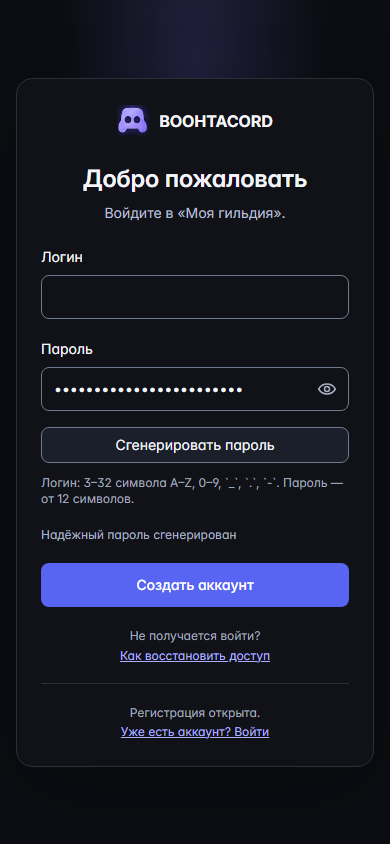
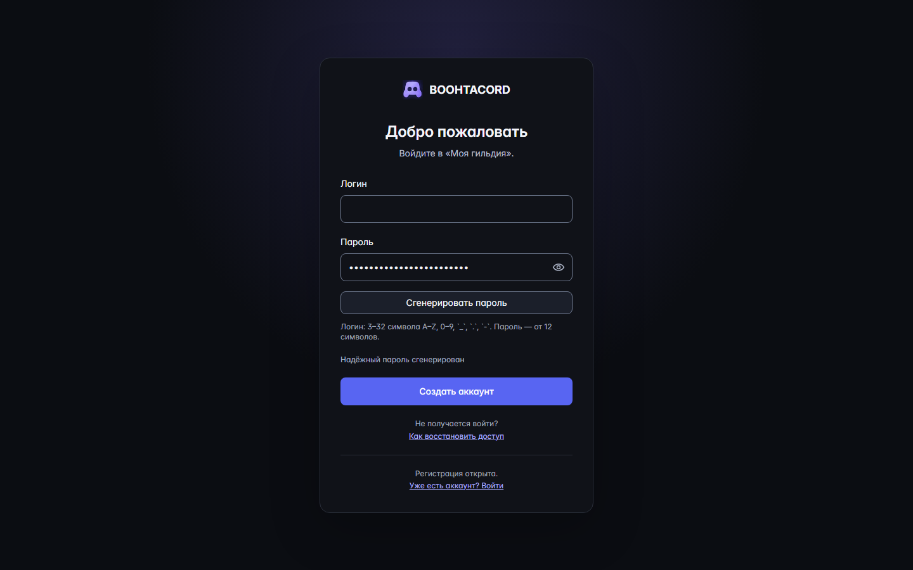
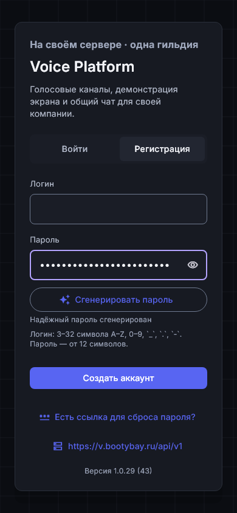
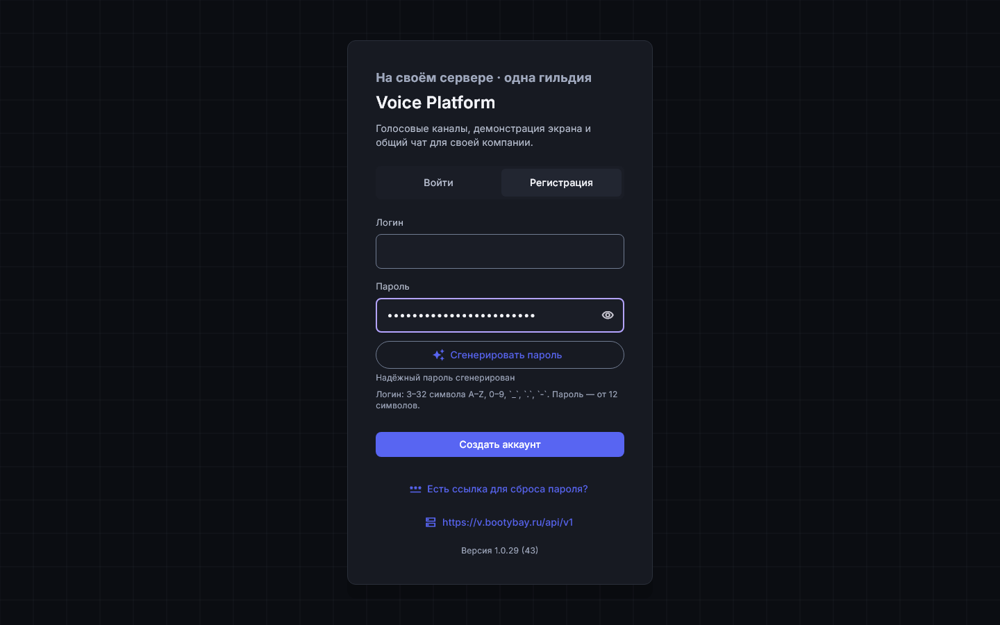

# Issue #104 — registration password generation

Date: 2026-10-04. Executor: Codex. Environment: Windows 11, Node 24.18.0, Flutter 3.47.5, Dart 3.13.4, headless Chromium via Playwright 1.63.0.

Scope: the real Vue `AuthenticationLanding` and Flutter `AuthScreen`, their pure generators, lifecycle and registration controls. Baseline: `ea69c38cbfa8e25e20d3c4566ef75d6313c7b7c4`; implementation is the PR head containing this record.

## Corrections

- Fixed Flutter clearing a controller after disposal and after an asynchronous authentication result had unmounted its screen.
- Clear the Web ref and retained DOM input on disposal; suppress a late authentication callback and follow-up login after unmount.
- Clear prior password validation and server errors after successful generation; preserve entered text if secure generation fails.
- Confirm replacement of every nonempty password; **Оставить** leaves it unchanged. Editing cancels the stale confirmation and status.
- Use a proper password label with separate action controls and an accessible confirmation group. Generation focuses the password field and announces only a fixed non-secret status.
- Disable generation while submitting; prevent duplicate submissions and mode changes during authentication.
- Replaced source-string UI assertions with actual browser and widget interaction tests.
- Corrected invalid Dart constant expressions in existing voice shortcuts that prevented the Flutter suite and builds from compiling.

## Observed checks

| Check | Result |
| --- | --- |
| `npm test` | PASS — 996 tests |
| `npm run test:password-generation` | PASS — 8 browser scenarios, 390×844 and 1440×900 |
| `npm run build` | PASS |
| Focused Flutter auth/generator/shortcut checks | PASS — 24 tests |
| `flutter test --no-pub` | PASS — 510 tests before adding two capture-only layout checks |
| `flutter test --no-pub test/password_generation` | PASS — 7 interaction, lifecycle and layout checks |
| `flutter analyze --no-pub --no-fatal-infos` | PASS — no errors or warnings; existing informational lints remain |
| Android debug build | PENDING |
| Windows release build | PENDING |
| PR CI | PENDING |

Generators are checked for exact ASCII alphabet and length, required classes, deterministic injection, rejected bytes at each class/union boundary, and cryptographic choice/shuffle. Web explicitly fails closed without Web Crypto and never falls back to `Math.random`. Flutter rejects invalid injected byte values.

Browser tests verify generation without network requests, no clipboard/storage writes, manual-password preservation, cancellation/confirmation, focus, reveal/hide, mode cleanup, validation cleanup, authentication submission and disposal during an outstanding request. Generated password values are not placed in assertion output. A real traced registration request is checked through an in-memory exporter: its password does not enter span names, attributes, events or status.

Flutter widgets verify narrow/desktop controls, new-password autofill, disabled autocorrection/suggestions/personalized IME, focus, live status, replacement confirmation, mode cleanup, validation cleanup, successful-auth cleanup and disposal before a request finishes.

## Actual screens

The captures use the real production components and bundled styles/fonts. Every password is hidden before capture. No generated secret, browser trace or video is retained.

### Web

### Flutter

Visual inspection: labels and generator fit the narrow card, password hide control remains accessible, status is readable, and controls do not overflow. Existing login/reset/server flows are preserved. These captures demonstrate the added registration UX; they do not claim full design-package parity.

## Limits

Authentication HTTP responses in focused UI checks are controlled fixtures. Real server ACL/session behavior is unchanged and remains covered by existing suites. Voice/media runtime and load capacity are outside this issue. iOS native compilation requires a macOS host and has not been run locally. Native build and hosted CI outcomes are recorded separately when completed.
